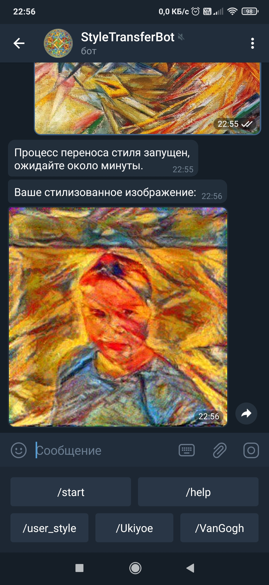

# Телеграм-бот для переноса стиля
Данный проект представляет собой Телеграм-бота для переноса стиля с одного изображения на другое.   
Также поддерживается быстрый перенос стиля с двух предобученных GAN-моделей: стиль Ван Гога и японский стиль Укиё-э.  
***Запуск:*** python3 bot.py    
Перенос стиля осуществляется с помощью нейросетей, соответствующая логика в файле nn_backbone.py   
Все подсказки по использованию бота вызываются командой /help   
Запускать желательно на машине с GPU c видеопамятью >= 8GB, тогда процесс переноса стиля в режиме user-style будет осуществляться намного быстрее.  
В файле config.py надо указать пути к предобученным GAN-моделям (подробнее в комментариях в файле config.py), а также токен бота (можно получить у @BotFather).  
Модели GAN были обучены в соответсвии с данным туториалом: https://www.tensorflow.org/tutorials/generative/cyclegan   
**Внешний вид бота:**  
 
